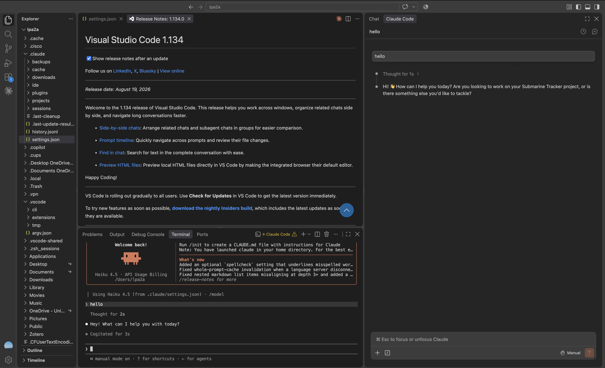

# Welcome to Technical Orientation
**Executive Summary:** This readme contains the materials for the technical orientation for incoming MSDS-R and PhD students. It includes the outline, links to resources, and details on assigned work. This orientation begins with a one hour in-person session and continues with individual homework competed before classes begin.

## The Goal
You will be able to do this

That is to say, configure VS Code with Claude Code and learn how to connect the harness to any model via an API.

## In-person Session Outline
1. Hello and Welcome
2. The inner game
3. The outer game
4. Work time

## Resources
1. [Slides](https://myuva-my.sharepoint.com/:p:/g/personal/lpa2a_virginia_edu/IQDDlSS1ivb2SaxQYfeLCxETAVPbTeIz75PjpN5zx2ZuhW4?e=MIE3jz)
2. [Configuration Files](https://myuva-my.sharepoint.com/:f:/g/personal/lpa2a_virginia_edu/IgCamzIL-xcHTKRvyL4eurrrAWnauEO6-whcjwKLTWe1p90?e=Dhk07C)
