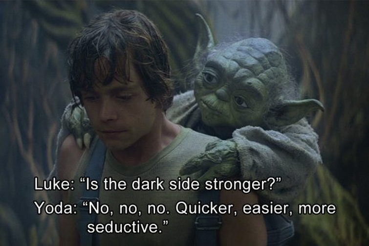
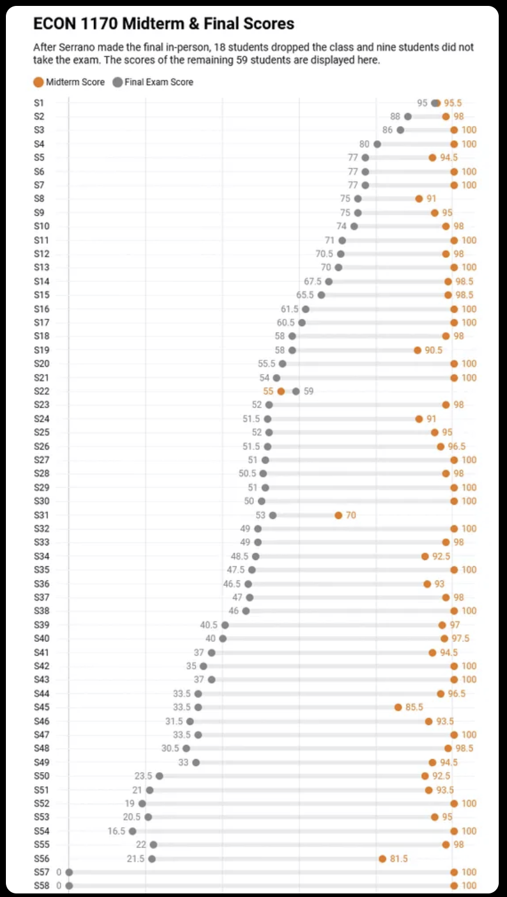
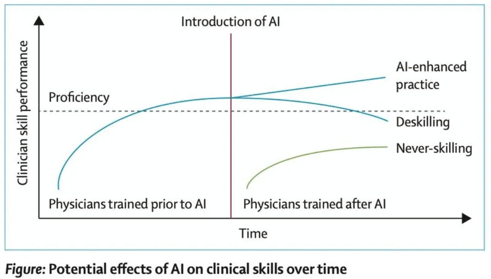
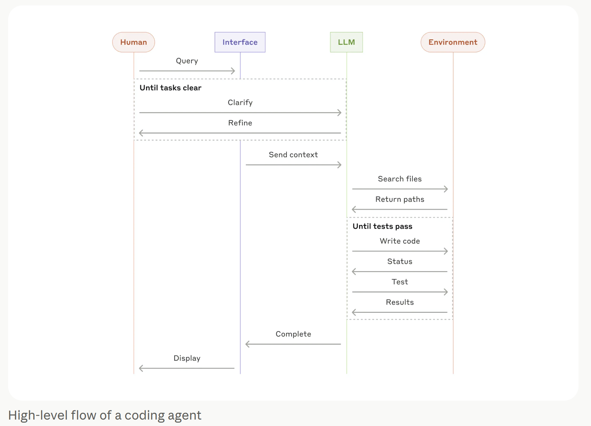
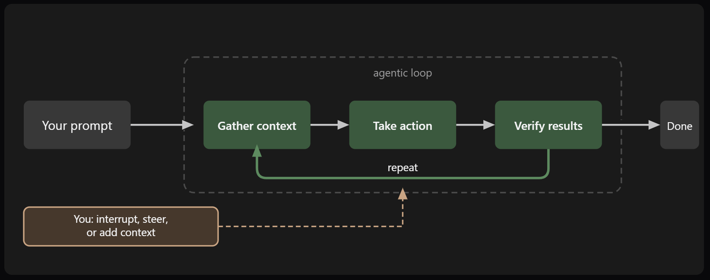
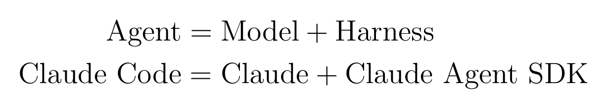
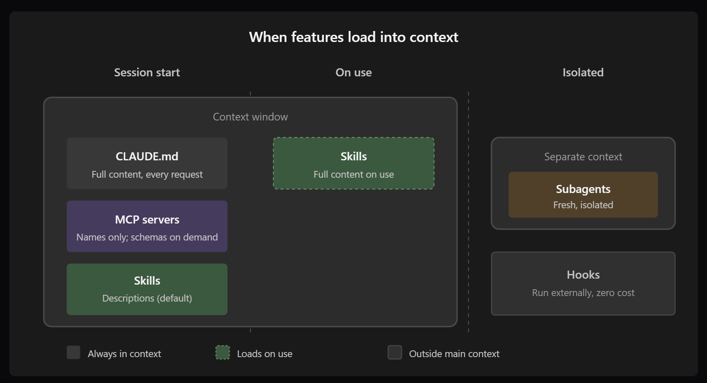
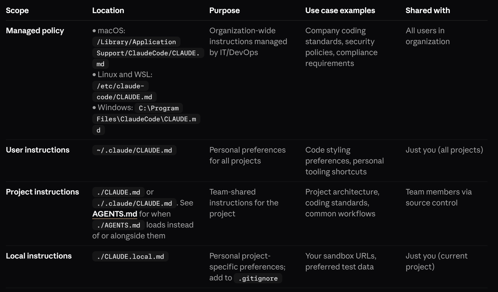
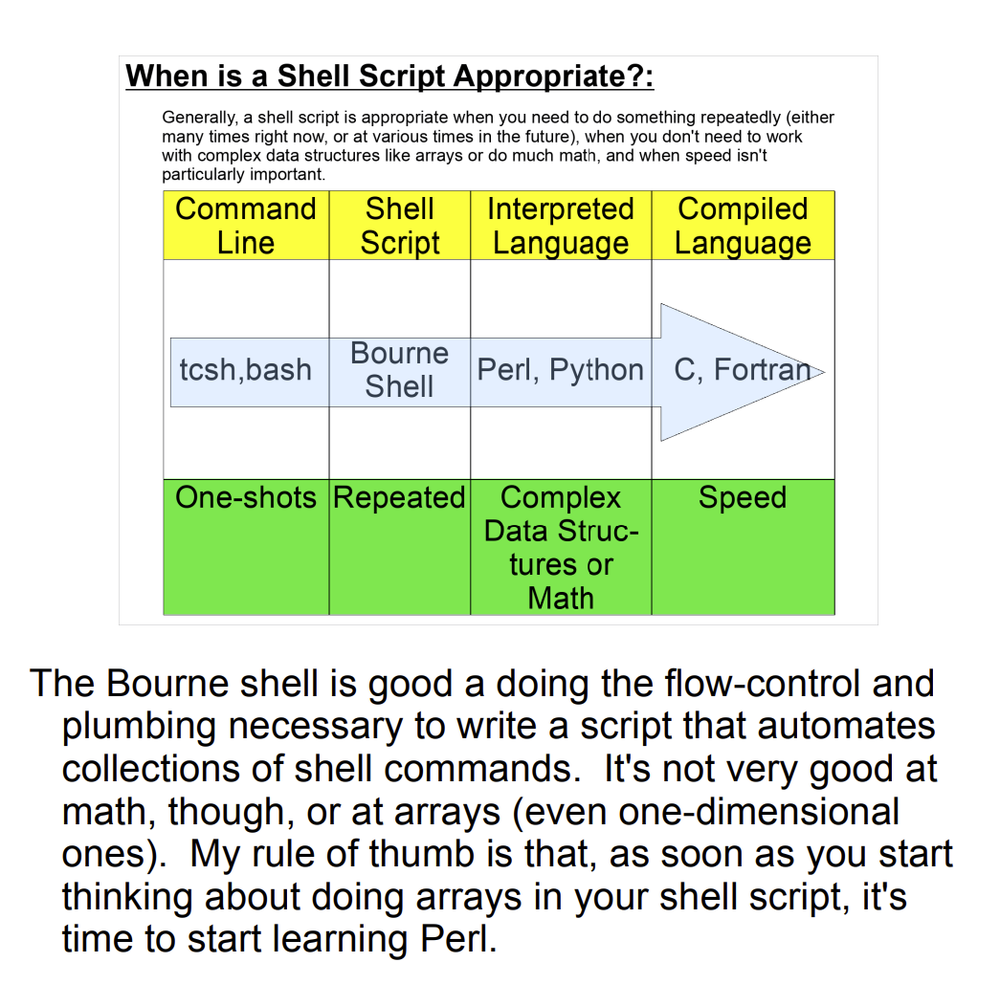

# Using Claude Code

## Preamble



## Motivation



## Specific Goals
**1. Show you the gym equipment**
* AI Workflow / Agentic Loop
    * Using the loop as designed
    * Avoiding Deskilling/Never-skilling
    * Understanding what you are telling the loop to do
    * Claude: "which is exactly how feynmf's auto-layout works internally"
* Review AI Coding Terminology 
* Extensions 
    * Contex (CLAUDE.md)
    * Skills (SKILL.md)

**2. Give you a workout plan**
* Definition Practice
* Coding Practice


# The Agent Loop

### Jan 2025 - before Claude Code


### Sep 2026 - after Claude code


**The main point is that the context is gathered two ways, from the user and the environment**

https://claude.com/blog/building-agents-with-the-claude-agent-sdk

## Jargon




.claude folder

commands and `/`

| Generic term | Claude version | Meaning | Motivation / When to use |
|---|---|---|---|
| Model | Claude |||
| Agent | Claude Code |||
| Harness | Claude Agent SDK (was Claude Code SDK Jan-Sep 2025)| | |
| Coding Agent | Claude Code | agentic coding solution | originally built to support developer productivity at Anthropic |
| Context ||||
| | Auto Memory|||
| Workspace | Project |||


| Skill | | ||
| CLAUDE.md ||||

| Model Context Protocol (MCP) | |standardized integrations to external services|e.g. search slack messages|

## Agent Harness


## Context
How Claude remembers your project - https://code.claude.com/docs/en/memory
CLAUDE.md files (aka AGENTS.md)
Automatic learning (aka Auto memory)


 -- https://code.claude.com/docs/en/features-overview
 -- https://code.claude.com/docs/en/memory

## Skills

1. you could just put it all into CLAUDE.md but, that costs, and isn't agile and connected to / commands

2. repeated instructions (instead of pasting the same multi-step prompt into chat every time)
3. something you keep re-explaining to Claude
4. a section of CLAUDE.md that's grown into a "how to do X" procedure (as opposed to information/facts)
5. 




> [!NOTE]
> Since a skill's body only loads when invoked, it costs nothing until used, unlike always-loaded CLAUDE.md content.

> [!NOTE]
> "A skill is a markdown file"

"a skill is a markdown file"

"Skills extend Claude’s knowledge with information specific to your project, team, or domain. Claude applies them automatically when relevant, or you can invoke them directly"


.claude/skills/api-conventions/SKILL.md
```---
name: api-conventions
description: REST API design conventions for our services
---
# API Conventions
- Use kebab-case for URL paths
- Use camelCase for JSON properties
- Always include pagination for list endpoints
- Version APIs in the URL path (/v1/, /v2/)
```


## Workout Plan

### Definition practice

### Coding Practice
* Work the docs: Complete [Step 3-8](https://code.claude.com/docs/en/quickstart#step-3-start-your-first-session) (we did 1 and 2 in orientation)
* Work the docs: Complete [Create your first skill](https://code.claude.com/docs/en/skills#create-your-first-skill)


# References
* Berzin & Topol, Preserving clinical skills in the age of AI assistance, The Lancet, 18 Oct 2025 (406:1719, PMID 41109709)
* https://discovery.phys.virginia.edu/~bkw1a/


https://www.anthropic.com/engineering/building-effective-agents   [2024]

https://code.claude.com/docs/en/features-overview

https://code.claude.com/docs/en/how-claude-code-works

https://code.claude.com/docs/en/features-overview


https://claude.com/blog/building-agents-with-the-claude-agent-sdk

https://martinfowler.com/articles/harness-engineering.html
