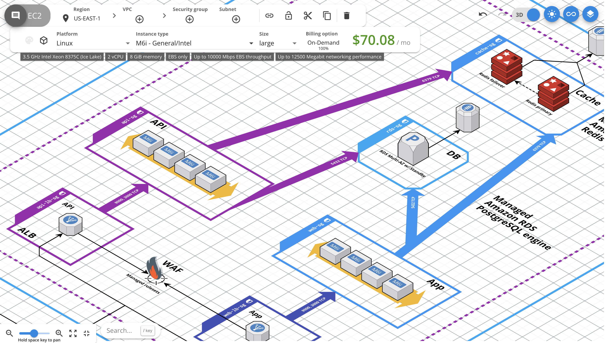

# Cloud Workshop
This workshop was delivered in the Capital One Hub on 2025-11-13

# Outline
1. Motivation
2. $$$
3. Event-driven computing

# Motivation
Not ".. well it's what I knew" but "I needed to accomplish B so I chose A because C"

## Why Cloud?
1. Financial (focus)
   * rent vs. own
2. Accesible
   * UVA red tape for static accesible IP   
3. Scalable
| |Power|Monthly Bill|# Homes|
|-|-----|------------|-------|
|Typical Household|1kW|$150|1|
|Data Center|1GW|$100,000,000|10^6|
   
4. Severless (focus)
   * lambda and "planned computation"
  
# Financial

Play around with this tool - [https://app.cloudcraft.co/](https://app.cloudcraft.co/)
| time | machine | specs | Example AWS | price/unit | total price |
|------|---------|-------|-------------|------------|-------------|
|4 days|laptop|8GB, 2 cores|t3.large|8¢/hr|768¢|
|7 hours|HPC|358GB, 40cores|m4.10Xlarge|200¢/hr|1,400¢|
|16 min| HPC w/GPU| + H200 |p5.4xlarge|688¢/hr|172¢|

## AWS Pricing
* [https://aws.amazon.com/ec2/pricing/on-demand/](https://aws.amazon.com/ec2/pricing/on-demand/)
* [https://aws.amazon.com/ec2/instance-types/p5/](https://aws.amazon.com/ec2/instance-types/p5/)

## Programmatically with boto
* [https://github.com/boto/boto3/blob/develop/README.rst](https://github.com/boto/boto3/blob/develop/README.rst)
* PSA - don't put your keys in your code or on github

# Serverless
This is a different paradigm of computing than most people start with.

Instead of read_csv(...) --> df.(...) --> model.train(df) --> etc.

An event happens --> run this lambda function (or more)

## Check out Chalice
[https://aws.github.io/chalice/](https://aws.github.io/chalice/)

# Next Steps
If you want to build your proficiency...
1. Create an event stream
2. Catch those events via an API
3. Store those events in s3
4. Perform analytics with lambda
5. Share results

# Bonus Material

