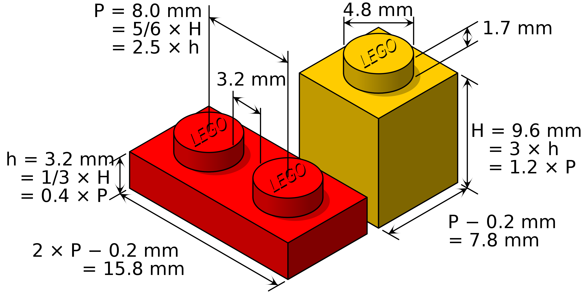
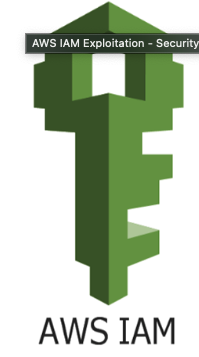

# Cloud Workshop

## Warm Up
Look up and record these metrics for your laptop
* CPU Cycle Rate (in GHz)
* CPU Number of Cores (int)
* RAM (in GB)
* Hard Drive Size (in GB)
* GPU

## Welcome & Introduction
1. `whois lpa2a` (aka who is the instructor)
2. `cat .plan` (aka goals for today)
    * Define and Motivate Cloud
    * Part I: Present the Data Scientist Minimum
    * Part II: Make individual plans for building cloud proficiency
    * Secret goal: But really, I just want you to ask questions

## Preamble
[0]
### "There are real computers on the ground"

## A quick note
We are going to talk about cloud computing but we will talk in the AWS vernacular.

## Exercise 0 - click on everything here - [https://app.cloudcraft.co/](https://app.cloudcraft.co/)

## A few building blocks (mini-lecture)
* s3 - Simple Storage Service 
* ec2 - Elastic Compute Cloud 
[1]

## Exercise 1 - Spec your Laptop using cloudcraft

## Exercise 2 - Spec two more machines using cloudcraft

## Exercise 3 - Do a price comparison using cloudcraft budget

## Why use the cloud (mini-lecture)
1. Scale - typical US home:100A :: typical AWS data center:2,500,000A
2. Prototyping - own:rent :: your laptop:AWS
3. Reproducibility - GUI:CLI :: your laptop:AWS

## Exercise 4 -  read this file [https://github.com/boto/boto3/blob/develop/README.rst](https://github.com/boto/boto3/blob/develop/README.rst)

## A few more building blocks (mini-lecture if time)
* iam 
* lambda 

# Break

## Event-driven computing (mini-lecture)
[2]
* AWS is for planned computation, not spontaneous exploration or memory manipulation

## The Method
Easy to say and understand ... hard to do.
[2]

## Your first prototype
1. Create an event stream
2. Catch those events via an API
3. Store those events in s3
4. Perform analytics with lambda
5. Share results

# References
[0] The internet, author unknown
[1] By Cmglee - Own work, CC BY-SA 3.0, https://commons.wikimedia.org/w/index.php?curid=14829196
[2] Jurassic Park

## Super secret instrutor notes
* [link](https://eservices-uva.awsapps.com/start)
* sa-lpa2a@myuva.onmicrosoft.com

# Bonus Material

# from professor magee
https://aws.github.io/chalice/

## AWS Pricing

[https://aws.amazon.com/ec2/pricing/on-demand/](https://aws.amazon.com/ec2/pricing/on-demand/)
