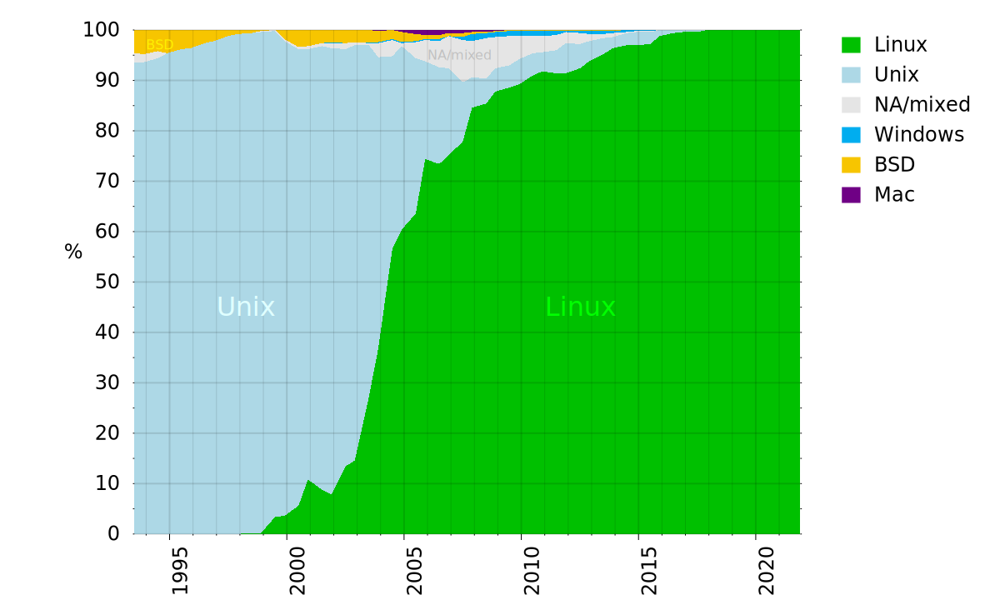
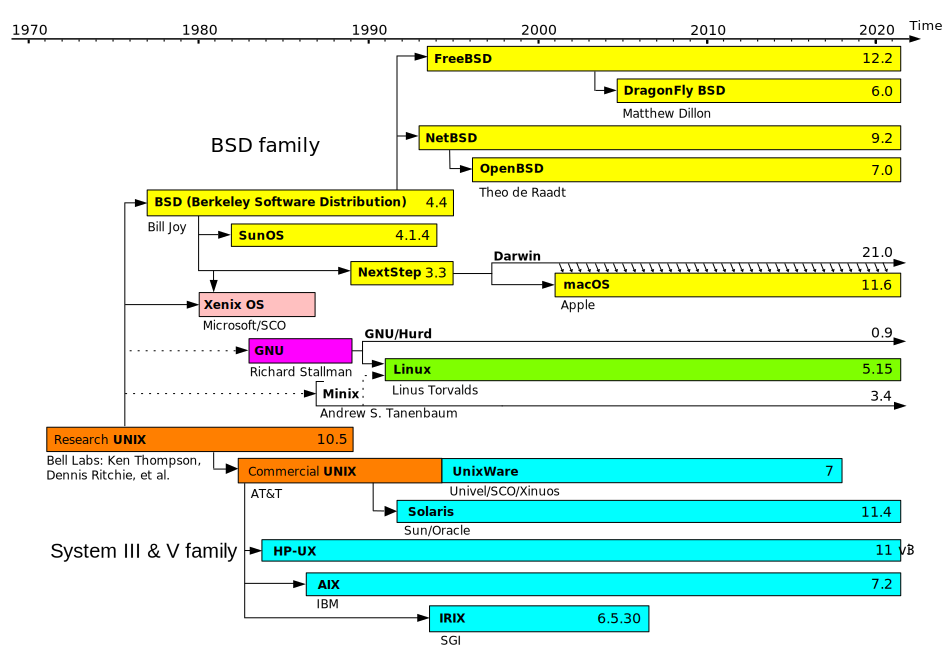
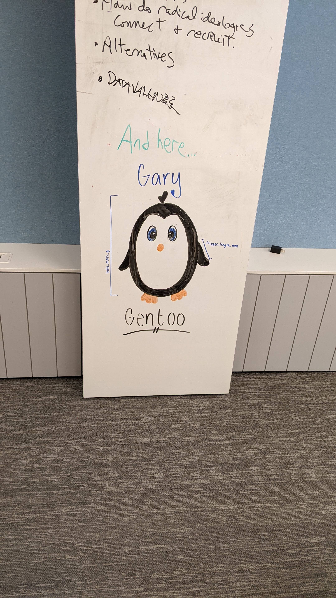
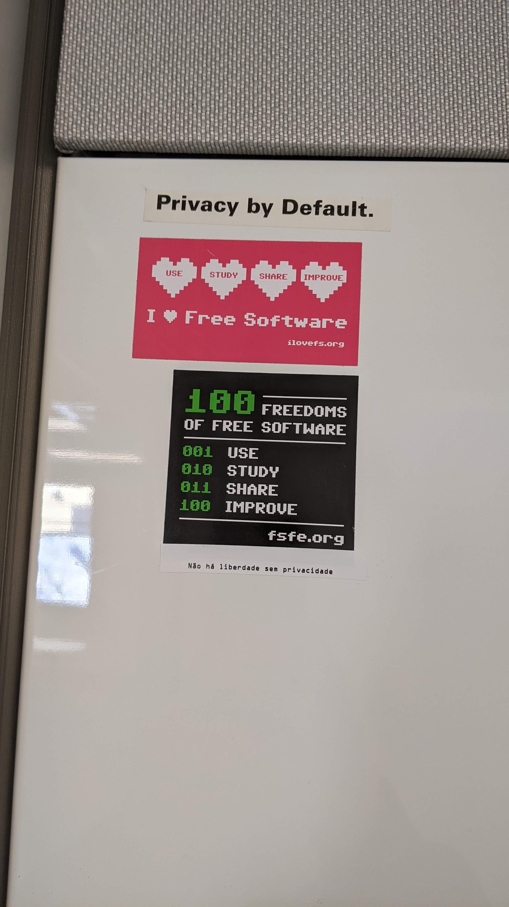

# GNU/Linux Workshop
**Executive Summary:** This document contains the materials for the UVA residential MSDS workshop on GNU/Linux. It is a compainion to the initial orientation given prior to the start of study. This workshop is part of a series designed to help students with the world larger than their own laptop. A world of high-performance computing and of cloud computing, a world dominated by GNU/Linux.

## Plan for Today
1. The GNU/Linux minimum (for Data Scientists)
2. break
3. How to build the GNU/Linux habit

## Preamble
[22](https://youtu.be/SP7dbl0rJS0?t=205)

## Introduction
1. `whois` lpa2a
2. Goals for today
    * Define GNU/Linux
    * Establish the Data Scientist minimum (part I)
    * Give you a plan to build the habit (part II)
    * But really I just want you all to ask questions
3. GNU/Linux is a habit
    * today: introduce you to the equipment
    * today: introduce you to a coach
    * today: create a workout plan
    * tomorow: hit the gym

## Motivation -- Why GNU/Linux? -- Simply put: it is the only relevant operating system
  *  [5]
  *  Top500 supercomputers [2]
  * One exception: Playing video games, which is >95% windows
  * Yes desktop/laptops are 75% windows, but smartphones are more common (60% to 40%).
  * Put another way: `conda install numpy`

### What is GNU/Linux

  * GNU = "GNU's not Unix", software suite in need of a kernel under GPL [6]
  * Unix = an operating system, not necessarially under open license
  * GPL = "GNU General Public License"
  * Linux = "Linus's Unix", a kernel under the GPL
  *  [7]
  * Put another way: GNU is the chocolate and Linux is the Peanut Butter

# Part I - Data Scientist GNU/Linux Minimum

## History [12]
 
## Open Software [13]
* The four freedoms (use, change, share, share changes)
* "copyleft": copyright the software and use it to ensure the freedoms
* The GPL: GNU General Public License
* Ethics question: What about software that breaks encryption? Should it be "free"?

## Culture

## Exercise
1. Get bash running on your machine
2. Explore the file system using - `pwd, ls, cd`
    * Everything is a file [9]
    *  [10]
3. Environment variables
    * `printenv` and `echo`
    * `$PATH`
    * `less ~/.bash_profile`
3. The story of manspacetar
4. Edit `.bash_profile` and `PS1` environment variable
    * **use** a terminal text editor - choose one [vi,nano,emacs,etc.]
5. Repeat this exercise but on Rivanna side by side with your local machine
    * hint `ssh rivanna.hpc.virginia.edu`
5. Exercise -- Send me an SMS or email from the command line
    * my email: lpa2a@virginia.edu
    * my sms: [[phone number]]@msg.fi.google.com

# Break - reconvene at ...

# Part II - building the habit

## Installation Demo (not included -- directions here [link](https://ubuntu.com/tutorials/install-ubuntu-desktop#1-overview))
* package management
* users, groups, permission
* ps and top
* ssh, scp, rsync

## Planning to build the GNU/Linux habit
1. Find a coach (wizard)
2. Pick a project
    * Classic Example - My roommate built a Tivo running gentoo
    * Contemporary Example - Build a Nintendo or Streaming Box using a Rasberry Pi and Ubuntu  [21]

# Wrap up
1. Please think of one thing you liked and why and one thing you would change and why.
2. Then make a pull request and add them to the next section "to improve for next time"

# To improve for next time
1. << put your feedback here >>

# Footnotes
[1]  TOP500 list. The benchmark we decided on was Linpack, which means that systems are ranked only by their ability to solve a set of linear equations, A x = b, using a dense random matrix A. Therefore, any supercomputer – no matter what its architecture is – can make it into the TOP500 list - topp500.org
[2] By Benedikt.Seidl - Eigenes Werk (own work) / source top500.org, Public Domain, https://commons.wikimedia.org/w/index.php?curid=5932978
[3] https://www.gartner.com/en
[4] gs.statcounter.com
[5] By Smartmo - Own work, CC BY-SA 3.0, https://commons.wikimedia.org/w/index.php?curid=22720596
[6] https://www.gnu.org/gnu/gnu-history.html
[7] By Shermozle at English Wikipedia, CC BY-SA 3.0, https://commons.wikimedia.org/w/index.php?curid=11478957
[8] The internet, author, unknown
[9] https://en.wikipedia.org/wiki/Filesystem_Hierarchy_Standard
[10] By Ppgardne - Own work, CC BY-SA 4.0, https://commons.wikimedia.org/w/index.php?curid=49654565
[11] https://en.wikipedia.org/wiki/Usage_share_of_operating_systems#:~:text=As%20of%20September%202022%2C%20Android,also%20using%20the%20Linux%20kernel.
[12] By Guillem, Wereon, Hotmocha (copied from old version&#039;s history)Christoph S. (redrew the image with Inkscape) - Original image: Image:Unix.png, Public Domain, https://commons.wikimedia.org/w/index.php?curid=1667764
[13] https://www.gnu.org/licenses/quick-guide-gplv3.html
[14] https://rivanna-portal.hpc.virginia.edu/
[15] `echo "text" | mailx [[phone number]]@msg.fi.google.com`
[16] https://www.gnu.org/gnu/why-gnu-linux.html 
[17] https://www.fsf.org/ 
[18] http://galileo.phys.virginia.edu/compfac/courses/sysadmin1/ 
[19] https://github.com/UVADS/orientation-technical 
[20] https://mobaxterm.mobatek.net/download-home-edition.html
[21] https://www.raspberrypi.com/products/raspberry-pi-4-model-b/
[22] https://youtu.be/SP7dbl0rJS0?t=205

