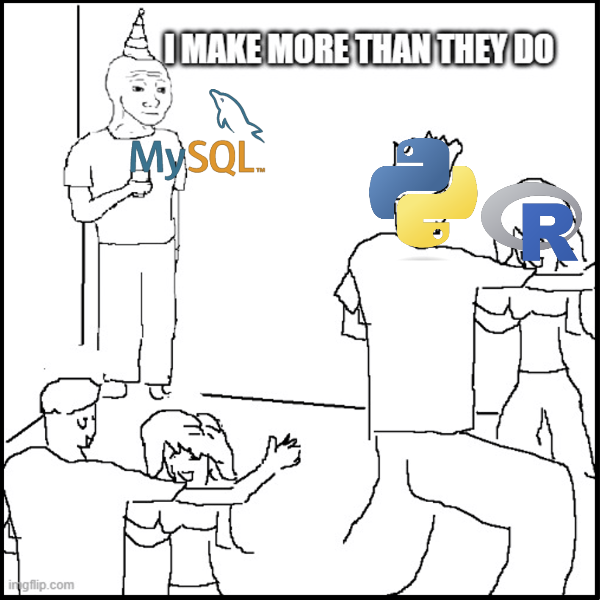

# SQL Workshop
**Executive Summary** This document contains the materials for the UVADS workshop on SQL by Professor Alonzi. 

## Outline
2. Introduction
3. Preamble
4. The Data Scientist Minimum for SQL
5. Your first SQL project


## Introduction
1. `whois` lpa2a
2. Goals for today
    * Define and Motivate SQL
    * Prt I: Present the Data Scientist Minimum
    * Part II: Make individual plans for building SQL proficiency
    * _Secret goal: But really, I just want you to ask questions_


## Preamble


**You have to have some moves. But you really need to be able to talk to the nerd in the corder.**

# Part I - The Data Scientist Minimum
## What is SQL?
SQL = **S**tructured-**Q**uery-**L**anguage

pronounced S-Q-L; less commonly "sequel"; now, sometimes "squirrel" [citation needed]

## OK but what ... **is** ... SQL?

The language you use to get data out of a relationtional database (RDB)

## OK but what ... **is** ... RDB?

Let's just take a look.
1. Whiteboard - the relational model
2. On your computers - explore an example

```
use sakila;
show tables;
describe customer;
select * from customer LIMIT 10;
select first_name, last_name from customer LIMIT 10;
```

3. Whiteboard - The RDB diagram
4. On your computers - explore an example


## Why SQL? (from a problem solving standpoint)
Integration

## Definitions
* Table
    * Row - tuple or record
    * Column - attribute or field
* Schema
* Query --> View
* Procedure aka `CALL procedure(...)`
* Primary Key
* Foreign key - primary key from another table

## spreadsheet vs database

## Impedance Mismatch

## CRUD and other commands

| | | |
|-|-|-|
|C|reate|`insert`|
|R|ead|`select`|
|U|pdate|`update`|
|D|elete|`drop`|

* `use`, `show`, `describe`, `limit`, `where`


# Part II
**Objective: Create an individual plan for you to practice your HPC skills**

Step A - bake the cake from scratch
1. Choose a topic you know well
2. Create an ER-diagram for that topic (make the Entity-relationship model)
3. Create the Schema
4. Choose platform
5. Create the data base
6. Populate and use the data base

Step B - hop on a moving train
1. Find a database in production
2. Find out a tack that needs doin
3. Get it done

# Wrap up
1. Please think of one thing you liked and one thing you would change about this workshop. And a few sentences about why.
2. Then make a pull request and add them to this repo in the folder workshop-gnu-linux/feedback.


# Resources
* Fun Lecture - [Introduction to NoSQL • Martin Fowler • GOTO 2012](https://youtu.be/qI_g07C_Q5I?si=pEkFdkTYquHfcv85)
* Good Book - [Learning SQL by Alan Beaulieu from O'Reilly](https://search.lib.virginia.edu/sources/uva_library/items/u11457927)
* SQL Practice Platform - [Cloud Beaver](https://demo.cloudbeaver.io)

# Footnotes
[1] 

[2] 
